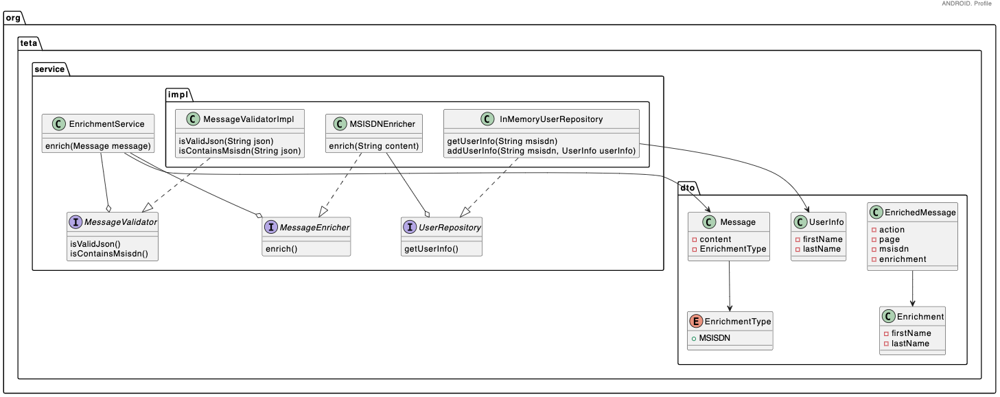

## Концепция

Пользователь отправляет `DTO` в следующем формате:
```java
public class Message {
private String content;
private EnrichmentType enrichmentType;

    public enum EnrichmentType {
        MSISDN
    }
}
```
`DTO` содержит сообщение `content` и тип обогащения `enrichmentType`.

`MSISDN` - это обогащение по номеру телефона. В качестве результата обогащения добавляются `firstName` и `lastName` в поле `enrichment`.

#### Пример

Входное сообщение:
```json
{
    "action": "button_click",
    "page": "book_card",
    "msisdn": "88005553535"
}
```
Обогащенное сообщение:
```json
{
    "action": "button_click",
    "page": "book_card",
    "msisdn": "88005553535",
    "enrichment": {
        "firstName": "Vasya",
        "lastName": "Ivanov"
    }
}
```
Условия обогащения по MSISDN:

* Сообщение должно быть в формате JSON.
* В `JSON` должно быть поле `msisdn` со строковым значением. Остальные поля произвольны.
* По указанному `MSISDN` подставляется соответствующая информация.
* Если поле `enrichment` уже есть в сообщении, оно перезаписывается.
* Если одно из условий не соблюдается (сообщение не формате `JSON`, поле `msisdn` отсутствует или информация не найдена), сообщение возвращается в том же виде, в котором пришло.

### Точка входа

Точкой входа в приложение должен являться класс `EnrichmentService` с методом `enrich`.

```java
public class EnrichmentService {
// возвращается обогащенный (или необогащенный content сообщения)
    public String enrich(Message message) {}
}
```
Важно: Никакие другие `API` добавлять не нужно (`CLI`, `GUI`, `REST`). Работоспособность проверяем с помощью Unit-тестов.

### Требования к реализации

* Система должна работать корректно в многопоточной среде. Предполагаем, что метод `enrich` может вызываться параллельно из разных потоков.
* Информация о пользователях хранится в памяти. Предполагаем, что она может периодически меняться в другом потоке.
* Каждое обработанное сообщение дополнительно должно сохраняться в одной из двух структур данных в зависимости от того, было ли сообщение успешно обогащено, или нет. Например, список обогащенных и необогащенных сообщений.
* Должен быть написан хотя бы один `End-to-End` тест, который проверяет, что система работает корректно в многопоточном режиме. Как вариант, можно использовать `ExecutorService` и `CountDownLatch` или `Phaser` для запуска нескольких задач одновременно.
* Несмотря на то что в системе всего один тип обогащения (`MSISDN`), код необходимо написать так, чтобы он был открыт для дальнейшего расширения (вспомните урок по GoF-паттернам).
* `End-to-End` тест тестирует всю систему целиком, а не каждый компонент по отдельности.

### Советы

Не нарушайте принцип инверсии зависимостей, так как это сильно усложнит и тестирование, и разработку в целом.

```java
public class EnrichmentService {
// принцип DI нарушен
private final MessageValidator validator = new MessageValidatorImpl();

    public String enrich(Message message) {}
}
```
```java
public class EnrichmentService {
// принцип DI НЕ нарушен
private final MessageValidator validator;

    public EnrichmentService(MessageValidator validator) {
        this.validator = validator;
    }

    public String enrich(Message message) {}
}
```
Не пытайтесь решить проблему с "наскока". Разбейте систему на компоненты, протестируйте каждый из них отдельно, а потом совместите по кусочкам.
Для валидации JSON можно использовать библиотеку [JSONAssert](https://www.baeldung.com/jsonassert).
Полученные результаты оформите в Pull Request и отправьте на ревью ментору.

### Info
